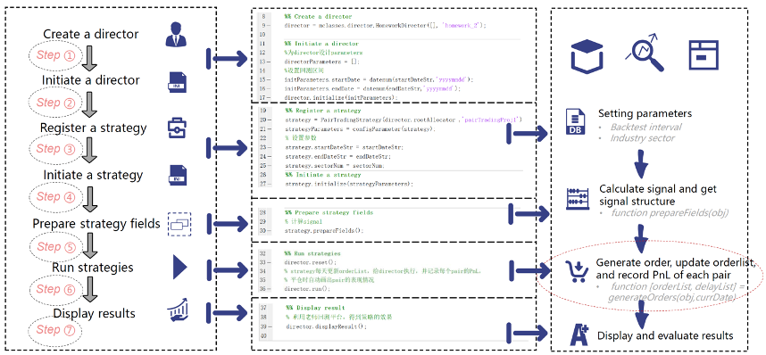
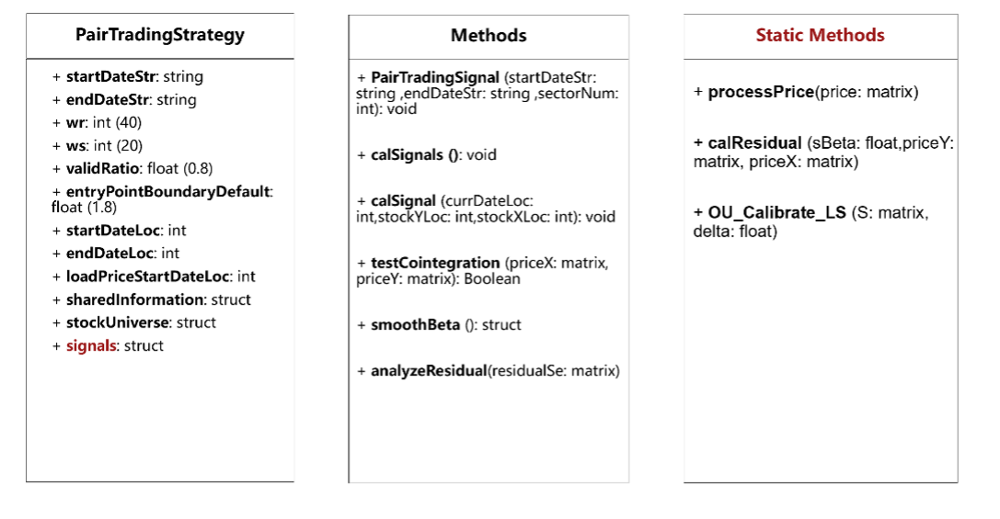
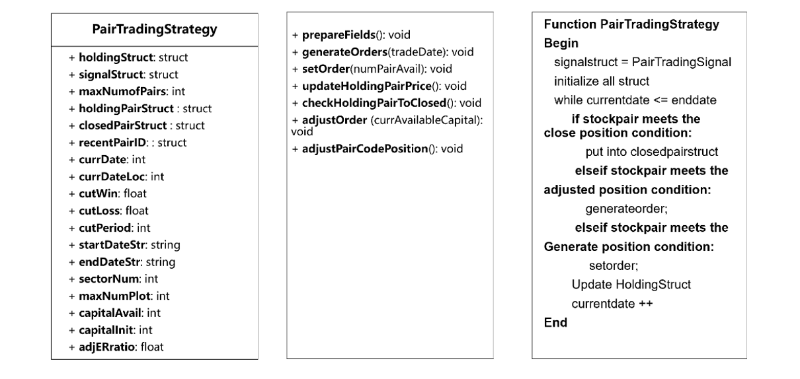
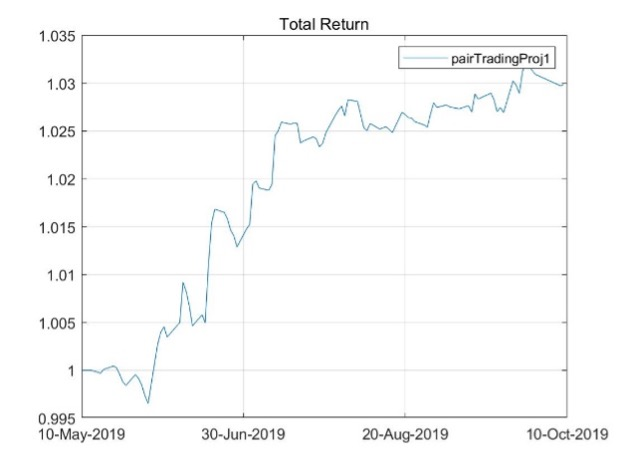
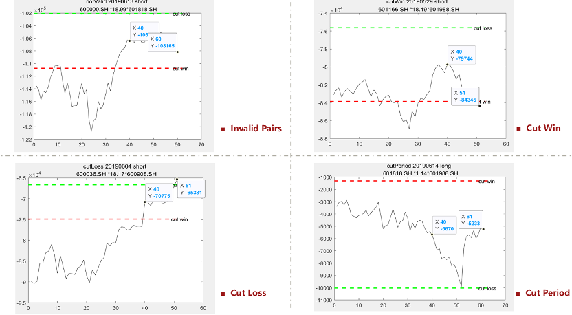
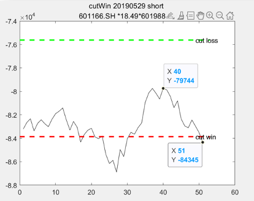

# **Software Engineering Project**

# 📈 Pair Strategy

Credits to [@Lethe Ye](https://github.com/lethe-ye) who writes most of the codes 👏.

**1.**   **Overview**

The logic of important steps:

- **Register a strategy:** set parameters, such as Backtest interval, Industry sector. 
- **Prepare strategy fields:** we will calculate signal and get signal structure form function prepareFields. 
- **Run strategy:** we will judge whether we need to set order at a certain point based on the signal structure obtained from the prepareFields, and decide to open a new buy order or close a position, and then we will track each pair and draw a PnL curve to output each pair's performance, and update the order list every day. 
-  **Display result:** Pass the order list to the director, which will do some operations, and then we use backtesting platform to display the results. 

 

**2.**   **Signal Class**

The output of signal is a structure. The structure contains the information of each pair of stocks and trading day. Each element is a three-dimensional matrix, corresponding to [trading day, serial number of stock A, serial number of stock B].

 

**3.**   **Strategy Class**

**Step 1. Prepare fields.** The fields to initialize all the parameters and calculate the signals. 

**Step 2. Generate orders.** The fields to update daily orders’ adjustment. Before adjusting positions, it is necessary to check close position condition.

**Step 3. Set orders.** The fields to set daily orders.

**4.**   **Performance**

Positions need to be closed in four cases: invalid pairs, cut win, cut loss, and cut period. These four examples are shown in these four figures.

We carried out **sensitivity analysis** under different parameters. First, we select the results of different sectors, including 20 stocks in mining, chemical industry, steel, non-ferrous metals and banking. The time period is from May 10 to October 10 in the year of 2019. The test results show that the annualized rate of return in the bank sector is the highest.

 

**5.**   **Highlights & Bug Reporting**

- **Signal:** for the fourth dimension we need to store the property information and it’s like a struct, and cell is not sufficient in Matlab.
- **Strategy**

We  include a property named closeReason to show in which situation we close this order. This figure shows the cutWin situation. But the output of the strategy should be orderList! Now, we only have separate information of each pair. Then we need to deal with these messy pairStruct to get the net position of each stock.

 

😄 Ask about anything and feel free to give issues and pull requests!
